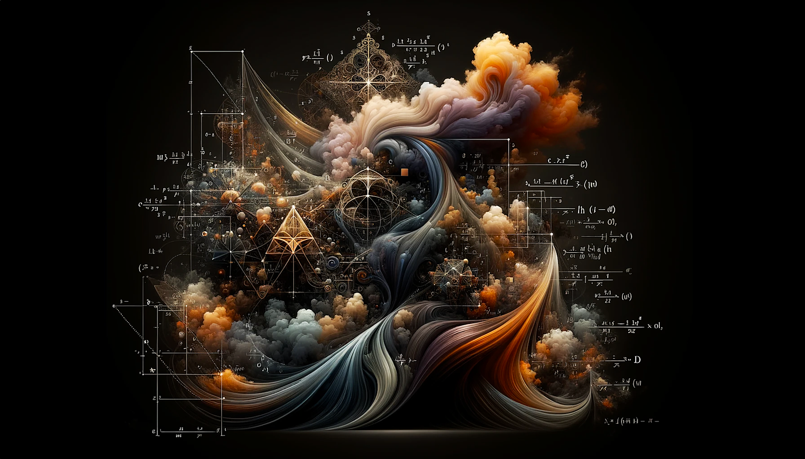

<html> 
	  
	
</html>

---
  
# Notebooks  
  
### 00 Basics  
  
  
---
# References  
  
- [Caltech Learning From Data, Professor Yaser Abu-Mostafa](https://work.caltech.edu/telecourse.html), [included Homework assignments](https://work.caltech.edu/homeworks.html), [YouTube Playlist](https://www.youtube.com/playlist?list=PLD63A284B7615313A)  
- [CMU's Deep Learning Systems: Algorithms and Implementation course](https://dlsyscourse.org/lectures/), [GitHub](https://github.com/dlsyscourse), [YouTube](https://www.youtube.com/@deeplearningsystemscourse1116)  
- [Carnegie Mellon University Deep Learning](https://www.youtube.com/@carnegiemellonuniversityde4339)'s playlists:  
	- Spring 2024: [lectures](https://www.youtube.com/playlist?list=PLp-0K3kfddPxUJzAW0KxNNjGiK_hISFas), [recitations](https://www.youtube.com/playlist?list=PLp-0K3kfddPzNnco9QQAoTx_sVhZgHK-n)
	- Fall 2023: [lectures](https://www.youtube.com/playlist?list=PLp-0K3kfddPzMmSaoGy5SqQsqhUeMC1ay), [recitations](https://www.youtube.com/playlist?list=PLp-0K3kfddPy-MKXnPumVfnfh09aq1LOR)
	- Spring 2023: [lectures](https://www.youtube.com/playlist?list=PLp-0K3kfddPwgBSCbDtT6NaVOd-gIHVMW), [recitations](https://www.youtube.com/playlist?list=PLp-0K3kfddPy99Ia2XeM7awOEmzTSzsSq)
  